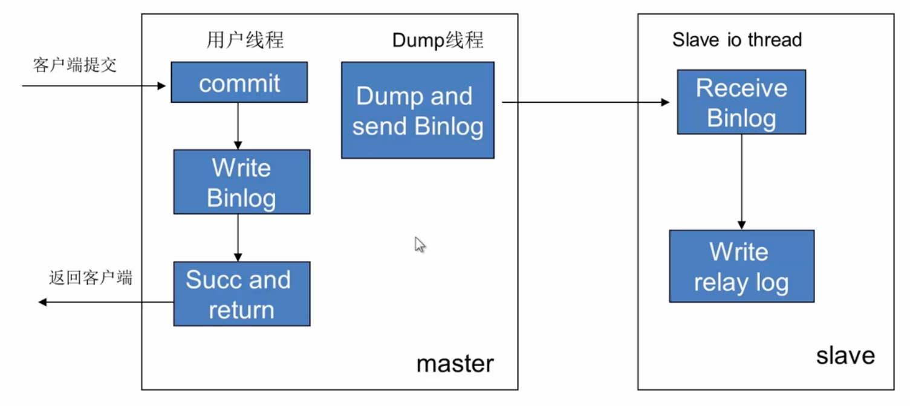
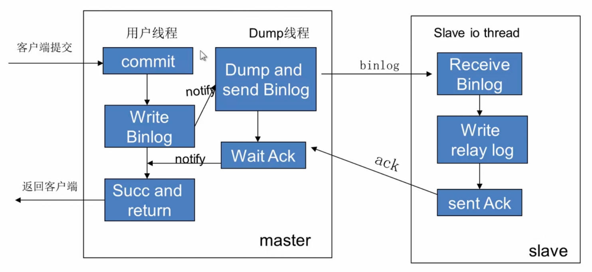

# MySQL运维实践

## 5.1-MySQL日志系统

### 什么是日志

* 日志(log)是一种顺序记录事件流水的文件
* 记录计算机程序运行过程中发生了什么
* 多种多样的用途
  * 帮助分析程序问题
  * 分析服务请求的特征、流量等
  * 判断工作是否成功执行
  * 等等……

### MySQL日志的分类

* 服务器日志
  * 记录进程启动运行过程中的特殊事件，帮助分析MySQL服务遇到的问题
  * 根据需求抓取特定的SQL语句，追踪性能可能存在的问题的业务SQL
* 事务日志
  * 记录应用程序对数据的所有更改
  * 可用于数据恢复
  * 可用于实例间数据同步

| 分类 | 日志名称 |
| :------------- | :------------- |
| 服务器日志 | 服务错误日志 |
| 服务器日志 | 慢查询日志 |
| 服务器日志 | 综合查询日志 |
| 事务日志 | 存储引擎事务日志 |
| 事务日志 | 二进制日志 |

### 服务错误日志

* 记录实例启动运行过程中重要消息
* 配置参数
  * `log_error = /data/mysql_data/node-1/mysql.log`
* 内容并非全是错误消息
* 如果mysqld进程无法正常启动首先查看错误日志

### 慢查询日志

* 记录执行时间超过一定阈值的SQL语句
* 配置参数

```sql
slow_query_log = 1
slow_query_log_file = /data/mysql_data/node-1/mysql-slow.log
long_query_time = 5
```

* 用于分析系统中可能存在性能问题的SQL

### 综合查询日志

* 如果开启将会记录系统中所有SQL语句
* 配置参数

```sql
general_log = 1
general_log_file = /data/mysql_data/node-1/mysql-slow.log
```

* 偶尔用于帮助分析系统问题，对性能有影响

### 查询日志的输出与文件切换

* 日志输出参数

`log_output={file|table|none}`

* 如果日志文件过大，可以定期截断并切换新文件

`flush log;`

### 存储引擎事务日志

* 部分存储引擎拥有重做日志(redo log)
* 如InnoDB, TokuDB等WAL(Write Ahead Log)机制存储引擎
* 日志随着事务commit优先持久化，确保异常恢复不丢数据
* 日志顺序写性能较好

### InnoDB事务日志重用机制

* InnoDB事务日志采用两组文件交替重用

### 二进制日志binlog

* binlog (binary log)
* 记录数据引起数据变化的SQL语句或数据逻辑变化的内容
* MySQL服务层记录，无关存储引擎
* binlog的主要作用：
  * 基于备份恢复数据
  * 数据库主从同步
  * 挖掘分析SQL语句

### 开启binlog

* 主要参数

```
log_bin = c:/tmp/mylog/mysql-bin
sql_log_bin = 1
sync_binlog = 1
```

* 查看binlog

`show binary logs;`

### binlog管理

* 主要参数

```
max_binlog_size = 100MB
expire_logs_days = 7
```

* binlog始终生成新文件，不会重用

* 手工清理binlog

```
purge binary logs to 'mysql-bin.000009';
purge binary logs before '2016-4-2 21:00:40'
```

### 查看binlog内容

* 日志

```
show binlog events in 'mysql-bin.000011';
show binlog events in 'mysql-bin.000011' from 60 limit 3;
```

* mysqlbinlog工具

```
mysqlbinlog c:/tmp/mylog/mysql-bin.000001
--start-datetime | --stop-datetime
--start-position | --stop-position
```

### binlog格式

* 主要参数

`binlog_format = {ROW|STATEMENT|MIXED}`

* 查看row模式的binlog内容

`mysqlbinlog --base64-output=decode-rows -v c:/tmp/mylpg/mysql-bin.000001`

## 5.2-MySQL数据备份

### 基本指数 - 备份用途

* 数据备灾
  * 应对硬件故障数据丢失
  * 应对人为或程序bug导致数据删除
* 制作镜像库以供服务
  * 需要将数据迁移、统计分析等用处
  * 需要为线上数据建立一个镜像

### 基本知识 - 备份内容

* 数据
  * 数据文件或文本格式数据
* 操作日志(binlog)
  * 数据库变更日志

### 基本知识 - 冷备份与热备份

* 冷备份
  * 关闭数据库服务，完整拷贝数据文件
* 热备份
  * 在不影响数据库读写服务的情况下备份数据库

### 基本知识 - 物理备份与逻辑备份

* 物理备份
  * 以数据页的形式拷贝数据
* 逻辑备份
  * 导出为裸数据或者SQL(insert)语句

### 基本知识 - 本地备份与远程备份

* 本地备份
  * 在数据库服务器本地进行备份
* 远程备份
  * 远程连接数据库进行备份

### 基本知识 - 全量备份与增量备份

* 全量备份
  * 备份完整的数据库
* 增量备份
  * 只备份上一次备份以来发生修改的数据

### 基本知识 - 备份周期

考虑因素：
  * 数据库大小(决定备份时间)
  * 恢复速度要求(快速or慢速)
  * 备份方式(全量or增量)

### 常用工具及用法

* mysqldump - 逻辑备份，热备
* xtrabackup - 物理备份， 热备
* Lvm/zfs snapshot - 物理备份
* mydumper - 逻辑备份，热备
* cp - 物理备份，冷备

### 常用工具及用法 - mysqldump

MySQL官方自带的命令行工具

主要示例：

* 演示使用mysqldump备份表、库、实例

```bash
# 备份所有数据库
mysqldump -uroot -p123456 --socket=/var/run/mysqld/mysqld.sock --all-databases > /dbbackup/all_db.sql
# 备份指定的数据库
mysqldump -uroot -p123456 --socket=/var/run/mysqld/mysqld.sock --databases db2 > /dbbackup/db2.sql
# 备份单个表
mysqldump -uroot -p123456 --socket=/var/run/mysqld/mysqld.sock db2 t1 >/dbbackup/db2_t1.sql
# 还原表
mysql > source /dbbackup/db2_t1.sql
```

* 演示使用mysqldump制作一致性备份

```bash
mysqldump --single-transaction -uroot -p123456 --all-databases > /dbbackup/add_db_2.sql
```

* 演示使用mysqldump远程备份一个数据库

```bash
mysqldump -utest -ptest -h192.168.0.68 -P3306 --all-databases > /dbbackup/remote_bakall.sql
```

* 演示使用mysqldump导出数据为csv格式

```bash
mysqldump -uroot -p123456 --single-transaction --fields-terminated-by=, db1 -T /tmp
```

### 常用工具及用法 - xtrabackup

特点：
  * 开源，在线备份InnoDB表
  * 支持限速备份，避免对业务造成影响
  * 支持流备
  * 支持增量备份
  * 支持备份文件压缩与加密
  * 支持并行备份与恢复，速度快

### xtrabackup备份原理

* 基于InnoDB的crash-recovery功能
* 备份期间允许用户读写，写请求产生redo日志
* 从磁盘上拷贝数据文件
* 从InnoDB redo log file实时拷贝走备份期间产生的所有redo日志
* 恢复的时候 数据文件 + redo日志 = 一致性数据

### 实用脚本innobackupex

* 开源Perl脚本，封装调用xtrabackup及一系列相关工具与OS操作，最终完成备份过程
* 支持备份InnoDB和其他引擎的表
* 备份一致性保证

### innobackupex备份基本流程

start xtrabackup_log -> copy .ibd; ibdata1 -> FLUSH TABLE WITH READ LOCK -> copy .FRM; MYD; MYI; misc files -> Get binary log position -> UNLOCK TABLES -> stop and copy xtrabackup_log

### innobackupex使用

主要示例：

* 全量备份

```bash
innobackupex --user=root --password=123456 --defaults-file=/etc/mysql/my.cnf /dbbackup
```

* 增量备份

```bash
innobackupex --user=root --password=123456 --defaults-file=/etc/mysql/my.cnf --incremental --incremental-dir /dbbackup/2016-4-3_13:24:32 /dbbackup
```

* 流方式备份

```bash
innobackupex --user=root --password=123456 --defaults-file=/etc/mysql/my.cnf --stream=xbstream /dbbackup/ > /dbbackup/stream.bak
```

* 并行备份

```bash
innobackupex --user=root --password=123456 --defaults-file=/etc/mysql/my.cnf --parallel=4 /dbbackup/
```

* 限流备份

```bash
innobackupex --user=root --password=123456 --defaults-file=/etc/mysql/my.cnf --throttle=10 /dbbackup/
```

* 压缩备份

```bash
innobackupex --user=root --password=123456 --defaults-file=/etc/mysql/my.cnf --compress --compress-thread 4 /dbbackup/
```

### 如何制定备份策略

需要考虑的因素

* 数据库是不是都是innodb引擎表 -> 备份方式，热备or冷备
* 数据量大小 -> 逻辑备份or物理备份，全量or增量
* 数据库本地磁盘空间十分充足 -> 备份到本地or远程
* 需要多块恢复 -> 备份频率 小时or天


## 5.3-MySQL数据恢复

### 什么时候需要恢复数据

* 硬件故障(如磁盘损坏)
* 人为删除(如误删除数据、被黑)
* 业务回滚(如游戏bug需要回档)
* 正常需求(如部署镜像库、查看历史某时刻数据)

### 数据恢复的必要条件

* 有效备份
* 完整的数据库操作日志(binlog)

### 数据恢复思路

* 最新一次备份 + binlog恢复到故障时间点(适用于各种数据丢失场景)
* 挖掘最后一次备份到故障点之间的binlog获取相关SQL语句，构造反转SQL语句并应用到数据库(只是用于记录丢失，且binlog必须是row格式)

### 反转SQL语句

例：

`t1(id primary key, a int)`

反转SQL语句：

`insert into t(id, a) values(1, 1)` -> `delete t1 where id=1 and a=1`
`update t1 set a=5 where id=1` -> `update t1 set a=1 where id=1`
`delete from t1 where id=1` -> `insert into t(id, a) values(1, 1)`

### 数据库恢复工具与命令

* mysqldump备份 -> source恢复
* xtrabackup备份 -> xtrabackup恢复
* binlog备份 -> mysqlbinlog恢复

### 详细示例讲解

* 恢复某几条误删数据
* 恢复误删表、库
* 将数据库恢复到指定时间点

### 恢复误删除数据

case：误操作，删除数据忘记带完整条件，执行`delete from user where age > 30 [and sex=male]`

需求：将被删除的数据还原

恢复前提：完整的数据库操作日志(binlog)

```sql
delete from user where sex='female';
```

```bash
# 首先需要找到binlog里的信息
mysqlbinlog -vv mysql-bin.000001
# 找出sql语句，然后写出反转sql语句
```

### 恢复误删表、库

case：业务被黑，表被删除了(drop teble user)

需求：将表恢复

前提：备份 + 备份以来完整binlog

```bash
innobackupex --apply-log /dbbackup/filename
# 查看binlog的位置点
cat xtrabackup_binlog_info
# 查看结束点
mysqlbinlog -vv filename

mysqlbinlog -vv --start-position=2556990 -- stop-position=2776338
mysqlbinlog -vv --start-position=2556990 -- stop-position=2776338 | mysql -uroot -p123456 --sock=/dbbackup/mysql_3309/mysqld.sock
```

### 课程小结

* 恢复是已经非常苦逼的差事，尽量避免做。我们要做数据卫士而不是救火队员。(线上应该严格把控权限，数据变更操作应事先测试，操作时做好备份)
* 有效备份(+binlog)是重中之重，对数据库定期备份是必须的
* 备份是一切数据恢复的基础


## 5.4-MySQL线上部署

### MySQL线上部署

考虑因素：

* 版本选择， 5.1、5.5还是5.6？
* 分支选择，官方社区版？ percona server？ Mariadb？
* 安装方式，包安装？二进制包安装？源码安装？
* 路径配置，参数配置(尽量模板化、标准化)
* 一个实例多个库 or 多个实例单个库？

### 二进制安装MySQL

* 下载软件包
* 解压放到指定目录(比如/usr/local)
* 将MySQL目录放到PATH中
* 初始化实例，编辑配置文件并启动
* 账户安全设置

### 编译安装MySQL

* 下载MySQL源码安装包
* 安装必要包(make cmake bison-devel ncurses-devel build-essential)
* Cmake配置MySQL编译选项，可以定制需要安装的功能
* make && make install
* 初始化实例，编辑配置文件并启动
* 账户安全设置

### MySQL升级

* 下载MySQL5.6安装包并配置MySQL5.6安装包安装路径
* 关闭MySQL5.5实例，修改部分参数，使用MySQL5.6软件启动
* 执行MySQL5.6路径下mysql_upgrade脚本
* 验证是否成功升级

### MySQL多实例安装

* 部署好mysql软件
* 编辑多个配置文件，初始化多个实例
* 启动MySQL实例

### MySQL多实例部署

为啥多实例部署？

* 充分利用系统资源
* 资源隔离
* 业务、模块隔离

### MySQL线上安装小结

* 根据需求选择合适的版本以及分支，建议使用或升级到较高版本5.5或5.6
* 如果需要定制MySQL功能的话，可以考虑编译安装，否则的话建议使用二进制包安装，比较省事
* 根据机器配置选择部署多个MySQL实例还是单个实例，机器配置非常好的话，建议部署多实例


## 5.5-MySQL主从复制

### MySQL主从复制

* 一主一从
* 主主复制
* 一主多从
* 多主一从
* 联级复制

### MySQL主从复制用途

* 实时灾备，用于故障切换
* 读写分离，提供查询服务
* 备份，避免影响业务

### MySQL主从复制部署

主从部署必要条件

* 主库开启binlog日志(设置log-bin参数)
* 主从server-id不同
* 从库服务器能连通主库

主从部署步骤：

* 备份还原(mysqldump或xtrabackup)
* 授权(grant replication slave on *.*)
* 配置复制，并启动(change master to)
* 查看主从复制信息(show slave status\G)

### MySQL复制存在的问题

存在的问题

* 主机宕机后，数据可能丢失
* 从库只有一个sql thread，主库写压力大，复制很可能延时

解决方法：

* 半同步复制
* 并行复制

### MySQL semi-sync(半同步复制)

半同步复制

* 5.5集成到MySQL，以插件形式存在，需要单独安装
* 确保事务提交后binlog至少传输到一个从库
* 不保证从库应用完这个事务的binlog
* 性能有一定的降低，响应时间更长
* 网络异常或从库宕机，卡住主库，直到超时或从库恢复

### MySQL异步复制



### MySQL semi-sync(半同步复制)



### 配置MySQL半同步复制

只需一次：

主库：

`INSTALL PLUGIN rpl_semi_sync_master SONAME 'semisync_master.so';`

从库：

`INSTALL PLUGIN rpl_semi_sync_slave SONAME 'semisync_slave.so';`

动态设置：

主库：

`SET GLOBAL rpl_semi_sync_master_enabled=1;`
`SET GLOBAL rpl_semi_sync_master_timeout=N;` master 延迟切异步

从库：

`SET GLOBAL rpl_semi_sync_slave_enabled=1;`

### 配置MySQL并行复制

并行复制

* 社区版5.6中新增
* 并行是指从库多线程apply binlog
* 库级别并行应用binlog，同一个数据库更改还是串行的(5.7版并行复制基于事务组)

设置

`set global slave_parallel_workers=10;` 设置sql线程数为10

### 联级复制

A -> B -> C

B中添加参数：
log_slave_updates
B将把A的binlog记录到自己的binlog日志中

### 复制监控

查询从库状态：

`show slave status\G`

### 复制出错处理

常见：1062(主键冲突) 1032(记录不存在)
解决：手动处理
或：
跳过复制出错
`set global sql_slave_skip_counter=1`

### 总结

* MySQL主从复制是MySQL高可用性、高性能(负载均衡)的基础
* 简单、灵活，部署方式多样，可以根据不同业务场景部署不同复制结构
* MySQL主从复制目前也存在一些问题，可以根据需要部署复制增强功能来解决问题
* 复制过程中应该时刻监控复制状态，复制出错或延时可能给系统造成影响
* MySQL复制是MySQL数据库工程师必知必会的一项基本技能


## 5.6-MySQL日常运维

### DBA运维工作

日常
  * 导数据、数据修改、表结构变更
  * 加权限、问题处理
其他
  * 数据库选型部署、设计、监控、备份、优化等

### 导数据及注意事项

* 数据最终形式(csv、sql文本 还是直接导入某库中)
* 导数据方法(mysqldump、select into outfile)
* 导数据注意事项
  * 导出为csv格式需要file权限，而且只能数据库本地导
  * 避免锁库锁表(mysqldump使用——single-transaction选项不锁表)
  * 避免对业务造成影响，尽量在镜像库做

### 数据修改及注意事项

* 修改前切记做好备份
* 开事务做，修改完检查好了再提交
* 避免一次 修改大量数据，可以分批修改
* 避免业务高峰期做

### 表结构变更注意事项

* 在低峰期做
* 表结构变更是否会有锁？(5.6包含online ddl功能)
* 使用pt-online-schema-change完成表结构变更
  * 可以避免主从延时
  * 可以避免负载过高，可以限速

### 加权限及注意事项

* 只给符合需求的最低权限
* 避免授权时修改密码
* 避免给应用账号super权限

### 问题处理(数据库慢？)

* 数据库慢在哪？
* show processlist查看mysql连接信息
* 查看系统状态(iostat, top, vmstat)

### 小结

* 日常工作比较简单，但是任何一个操作都可能影响线上服务
* 结合不同环境，不同要求选择最合适的方法处理
* 日常工作应该求稳不求快，保障线上稳定是DBA的最大责任


## 5.7-MySQL参数调优

### 为什么要调整参数

* 不同服务器之间的配置、性能不一样
* 不同业务场景对数据的需求不一样
* MySQL的默认参数只是个参考值，并不适合所有的应用场合

### 优化之前我们需要知道什么

* 服务器相关的配置
* 业务相关的情况
* MySQL相关的配置

### 服务器上需要关注哪些

* 硬件情况
* 操作系统版本
* CPU、网卡节电模式
* 服务器numa设置
* RAID卡缓存

### 磁盘调度策略-write back

* 数据写入cache既返回，数据异步的从cache刷入存储介质

### 磁盘调度策略-write through

* 数据同时写入cache和存储介质才返回写入成功

### Write Back VS Write Through

* write Back 性能优于 Write Through
* Write Through 比 Write Back安全性高

### RAID

* RAID Redundant Array of Independent Disks
  * 生产环境里一般不太会用裸设备，通常会使用RAID卡对一块盘或多块盘做RAID
  * RAID卡会预留一块内存，来保证数据高效存储与读取
  * 常见的RAID类型有:RAID1、RAID0、RAID10和RAID5

### RAID0 VS RAID1

* RAID 0 - Block Striped. No Mirror. No Parity.
* RAID 1 - Block Mirrored. No Stripe. No Parity.

### RAID5 VS RAID10

* RAID 5 - Block Striped. Distributed Parity.(至少三块盘，每块里有两个数据块和一个校验块)
* RAID 10 - Block Mirrored.(每两块盘做RAID1，然后再按组做RAID0，至少四块盘)

### RAID如何保证数据安全

* BBU(Backup Battery Unit)
  * BBU保证在WB策略下，即使服务器发生掉电或者宕机，也能够将缓存数据写入到磁盘，从而保证数据的安全

### MySQL有哪些注意事项

* MySQL的部署安装
* MySQL的监控
* MySQL参数调优

### 部署MySQL的要求

* 推荐的MySQL版本: >= MySQL5.5
* 推荐的MySQL存储引擎: InnoDB

### 系统调优的依据：监控

* 实时监控MySQL的slow log
* 实时监控数据库服务器的负载情况
* 实时监控MySQL内部状态值

### 通常关注哪些MySQL Status

* Com_Select/Update/Delete/Insert
* Bytes_received/Bytes_sent
* Buffer Pool Hit Rate
* Threads_connected/Threads_created/Threads_running

### MySQL参数调优

* 为什么要调整MySQL的参数
  * MySQL是通用数据库，但业务是多变的，默认参数无法满足所有业务需求
  * MySQL内部一些参数是在MySQL一些很老的版本时候做的，可能之前是做限流和保护用的，但随着机器性能的提高，这些保护类的参数可能会成为性能瓶颈

### 读优化

* 合理利用索引对MySQL查询性能至关重要
* 适当的调整参数也能提升查询性能

### innodb_buffer_pool_size

* InnoDB存储引擎自己维护一块内存区域完成新老数据的替换
* 内存越大越能缓存更多的数据

### innodb_thread_concurrency

* innoDB内部并发控制参数，设置为0代表不做控制
* 如果并发请求较多，参数设置较小，后进来的请求将会排队

### 写优化

* 表结构设计上使用自增字段作为表的主键
* 只对合适的字段加索引，索引太多影响写入性能
* 监控服务器磁盘IO情况，如果写延迟较大则需要扩容
* 选择正确的MySQL版本，合理设置参数

### 哪些参数有助于提高写入性能

* innoDB_flush_log_at_trx_commit && sync_binlog
* innodb log file size
* innodb_io_capacity
* innodb insert buffer

### 主要影响MySQL写性能的两个参数

* innoDB_flush_log_at_trx_commit
* sync_binlog

### innoDB_flush_log_at_trx_commit

* 控制InnoDB事务的刷新方式，一共有三个值：0,1,2
  * N=0 - 每隔一秒，把事务日志缓存区的数据写到日志文件中，以及把日志文件的数据刷新到磁盘上(高效，但不安全)
  * N=1 - 每个事务提交时候，把事务日志从缓存区写到日志文件中，并且刷新日志文件的数据到磁盘上，优先使用此模式保障数据安全性(低效，非常安全)
  * N=2 - 每事务提交的时候，把事务日志数据从缓存区写到日志文件中；每隔一秒，但不一定刷新到磁盘上，而是取决于操作系统的调度(高效，但不安全)

### sync_binlog

* 控制每次写入Binlog，是否都需要进行一次持久化

### 如何保证事务的安全

* innoDB_flush_log_at_trx_commit 和 sync_binlog都设为1
* 事务要和Binlog保证一致性

(加锁)-> xa_prepare, Fsync -> Write And Fsync Binlog -> InnoDB Commit, Fsync ->(释放锁)

### 串行有哪些问题

* SAS盘一般每秒只能有150~200个Fsync。
* 换算到数据库每秒只能执行50~60个事务

### 社区和官方的改进

* MariaDB提出改进，即使这两个参数都是1也能做到合并效果，性能得到了大幅提高。
* 官方吸收了MariaDB的思想，并在此基础上进行了改进，性能再次得到了提高

Tips:

* 官方在MySQL5.6版本之后才做了这个优化
* Percona和MariaDB版本在MySQL5.5已经包含了这个优化

### InnoDB Redo log

* Write ahead Log

### Redo log的作用

* Redo log用在数据库崩溃会的故障恢复

### Redo log有哪些问题

* 如果写入频繁导致Redo log里对应的最老的数据脏页还没有刷新到磁盘，此时数据库将卡住，强制刷新脏页到磁盘
* MySQL默认配置两个文件才10M，非常容易写满，生产环境中应适当调整大小。

### innodb_io_capacity

* InnoDB每次刷多少个脏页，决定InnoDB存储引擎的吞吐能力。
* 在SSD等高性能存储介质下，应该提高该参数以提高数据库的性能。

### Insert Buffer

* 顺序读写 VS 随机读写
* 随机请求性能远小于顺序请求

尽可能多的随机请求合并为顺序请求才是提高数据库性能的关键

* MySQL从5.1版本开始支持Insert Buffer
* MySQL5.5版本之后同时支持update和delete的merge
* Insert Buffer只对二级索引且非唯一索引有效

### 总结

* 服务器配置要合理(内核版本、磁盘调度策略、RAID卡缓存)
* 完善的监控系统，提前发现问题
* 数据库版本要跟上，不要太新，也不要太老
* 数据库性能优化：
  * 查询优化：索引优化为主，参数优化为辅
  * 写入优化：业务优化为主，参数优化为辅
